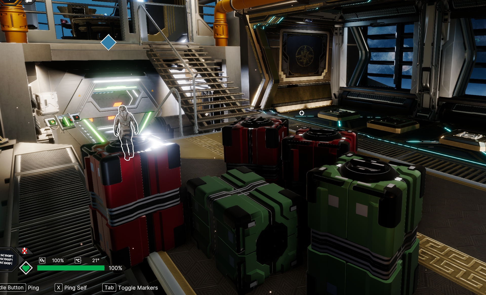

# Void Crew mod that allows for removing all components from the ship

Now you will be able to dismantle your ship components from any ships and put new ones without any problems.
Started with broadside but want to switch frontal only? No problem! Want to upgrade your Benedict Mk1 to Mk2? 
No problem! Want to remove all components from your ship and start from scratch? No problem!

## Licence
[CC Attribution-NonCommercial-ShareAlike 4.0 International](https://creativecommons.org/licenses/by-nc-sa/4.0/deed.en)

TLDR: You can use this mod in your modpack, but you can't sell it or claim it as your own. You need to mention me as the author. You can modify it, but you need to share your changes under the same licence.

## How to use
1. Install the BepInEx 5 mod loader (https://github.com/BepInEx/BepInEx/releases)
2. Run the game once to install BepInEx
3. Download the latest release of this mod from
4. Extract the zip file into the `BepInEx/plugins` folder
5. Run the game
6. Enjoy!

## How to build from source
1. Find in csproj file and change path of `Assembly-CSharp.dll` and other libraries to your own
2. Build project
3. Copy VoidCrewRemoveAllComponents.dll from `bin/Debug/netstandard2.1` to `BepInEx/plugins` folder
4. Run the game
5. Enjoy!

## How to report bugs
1. Open an issue on GitHub
2. Describe your problem in detail
3. Attach your player.log file (located in the games appdata folder)
4. Attach your BepInEx log file (located in the game BeInEx folder)